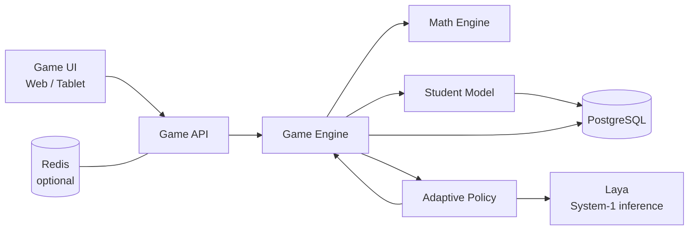
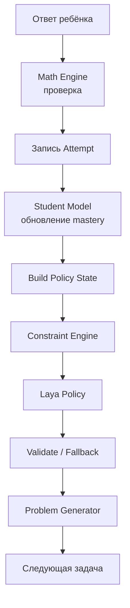

# HLD — Mental Math + Laya

> Current implementation direction: [approved web platform design](superpowers/specs/2026-09-24-mental-math-web-platform-design.md). The architecture below remains the source baseline; its bundled Laya deployment example is superseded by the operator-managed GPU Framework integration.

## 1. Цель

Создать локально разворачиваемую адаптивную игру по ментальной математике.

Система:
- генерирует арифметические упражнения;
- проверяет ответы детерминированно;
- ведёт профиль навыков ребёнка;
- адаптирует сложность;
- использует Laya как probabilistic policy engine.

---

## 2. Контекст системы



---

## 3. Компоненты

| Компонент | Ответственность |
|---|---|
| Game UI | интерфейс игры, ввод ответов, анимация |
| Game API | REST/WebSocket API |
| Game Engine | игровой цикл и orchestration |
| Math Engine | генерация и проверка задач |
| Student Model | расчёт прогресса и mastery |
| Adaptive Policy | подготовка state, вызов Laya, fallback |
| Laya | вероятностный выбор следующего действия |
| PostgreSQL | история, навыки, сессии, решения |
| Redis | активное состояние сессии, необязательно |

---

## 4. Основной поток



---

## 5. Логика адаптации

На вход Laya передаётся агрегированное состояние:

```json
{
  "current_skill": "addition_10_20",
  "current_difficulty": 2,
  "mastery": 0.61,
  "accuracy_5": 0.40,
  "avg_response_ms": 5200,
  "error_streak": 2,
  "last_error_type": "off_by_one"
}
```

Пример решений:

```text
repeat
easier
harder
switch
hint
```

---

## 6. Модель навыков

Навыки хранятся отдельно:

```text
addition_0_10
addition_10_20
subtraction_0_10
subtraction_10_20
doubles
near_doubles
make_10
multiplication_2
multiplication_3
...
```

Для каждого навыка хранятся:
- attempts;
- accuracy;
- recent accuracy;
- average response time;
- error streak;
- mastery.

---

## 7. Нефункциональные требования

### Производительность
Целевой latency policy decision:
- до 500 мс на CPU для одиночной игры;
- до 100 мс желательно при GPU.

### Надёжность
При недоступности Laya:
- игра не прерывается;
- используется deterministic fallback policy.

### Privacy
Все данные ребёнка остаются внутри локального контура.

### Observability
Логировать:
- game events;
- inference latency;
- policy decisions;
- fallback cases;
- model version.

---

## 8. Развёртывание

MVP:

```text
Docker Host
├── frontend
├── mental-api
├── laya
└── postgres
```

При необходимости:

```text
+ redis
+ prometheus
+ grafana
```

---

## 9. Эволюция

### V0
```text
Math Engine + Student Model + Rules
```

### V1
```text
Rules = production
Laya = shadow mode
```

### V2
```text
Laya + confidence gate + constraints
```

### V3
```text
Fine-tuned Laya
```
